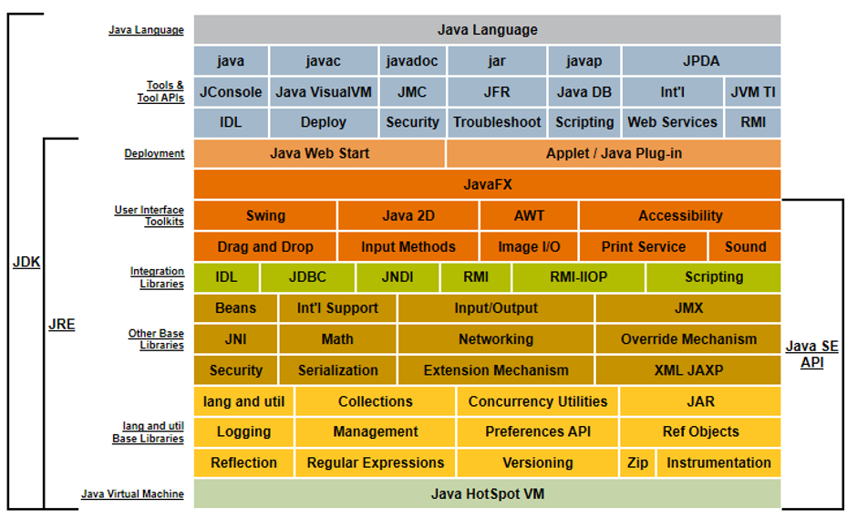

## 一、走进Java

------

### 1、Java技术体系

​	从广义上讲，Clojure、JRuby、Groovy等运行于java虚拟接上的语言及相关的程序都属于Java技术体系的一员。如果仅从传统意义上来看，Sun官方所定义的java技术体系包括以下几个组成部分：

- Java程序设计语言
- 各硬件平台的Java虚拟机
- Class文件格式
- Java API类库
- 来自商业机构和开源社区的第三方Java类库


​	其中，**Java程序设计语言**、**Java虚拟机**、**Java API类库** 这三部分统称为**JDK（Java Development Kit）**，JDK是用于支持Java程序开发的最小环境。

​	另外，可以把Java API类库中的 Java SE API子集 和 Java虚拟机这两部分称为**JRE（Java Runtime Environment）**，JRE是直接Java程序运行的标准环境。


下图为JDK 1.7规范的Java技术体系图：




​	如果按照技术所服务的领域来划分，Java技术体系又可分为4个平台：

- Java Card：支持一些Java Applets运行在小内存设备上的平台。
- Java ME：支持Java程序运行在移动终端上的平台。
- Java SE：提供完整的Java核心API，支持桌面级应用的平台。
- Java EE：支持构建企业级应用的平台。


### 2、Java版本演进

##### 前身：Oak语言

1991年4月，由James Gosling博士领导的绿色计划开启，此计划的目的是开发一种能够在各种消费电子产品（如机顶盒、冰箱、收音机等）运行的程序架构，这个计划的产品就是Java语言的前身：Oak(橡树)。

##### Java 1.0

1995年，JDK 1.0发布，Java第一次提出了 ：一次编写，到处运行（Write Once, Run Anywhere）的口号。

代表技术有：Java虚拟机、Applet小程序、AWT等。

> AWT:  AWT全称是抽象窗口工具集（Abstract Window Toolkit）,它是最早的sun提供的GUI库

##### Java 1.1

1997年发布，代表技术有：Jar文件格式，JDBC、JavaBeans、RMI，语法上增加：内部类(Inner Class)、和反射(Reflection)等。

> RMI：RMI（Remote Method Invocation），RMI是分布式对象软件包，它简化了在多台计算机上的JAVA应用之间的通信。远程方法调用是一种计算机之间对象互相调用对方函数，启动对方进程的一种机制，使用这种机制，某一台计算机上的对象在调用另外一台计算机上的方法时，使用的程序语法规则和在本地机上对象间的方法调用的语法规则一样。

##### JDK 1.2

1998年发布。Sun在该版本中把Java技术体系拆分为3个方向：J2SE、J2ME、J2EE。新的技术特性：EJB、Swing等。API上，增加了一系列 Collections 集合类。

1999年 HotSpot虚拟机发布。

##### JDK 1.3

2000年发布

##### JDK 1.4

2002年发布，这是Java真正走向成熟的一个版本。新技术特性有：正则表达式、异常链、NIO、日志类、XML解析器等。

.NET Framework 同年发布。

##### JDK 1.5

2004年发布，jdk1.5在语法易用性上改进很大，例如：自动装箱、泛型、动态注解、枚举、可变长参数、foreach循环等。在虚拟机和API层面，改进了Java内存模型（Java Memory Model, JMM）,提供了 java.util.concurrent并发包等。

##### JDK 1.6

2006年发布。这个版本中，sun公司终结了J2SE、J2EE、J2ME的命名方式，同时启用 Java SE、Java EE、Java ME的命名方式。

同年，Java 走向开源。

##### JDK 1.7

2011年发布。语法和API层面，增强了 Collections集合的功能、

```java
List<String> list = ["张三","李四","王五"];
Map<String,String> map = {"key1":"a", "key2":"b", "key3":"c"};
```

Switch支持String

##### JDK 1.8

2014年发布。语法上改进比较大，如：Lambda表达式、::运算符、新Stream API等

```java
Collections.sort(names, (a, b) -> b.compareTo(a));

List<String> nameList = Arrays.asList("张三","李四","王五","钱五");
nameList.stream().forEach(System.out::println);
```


##### JDK 9

2017年发布。

##### JDK 10

2018年3月发布

##### JDK 11

2018年9月发布

##### JDK 12

2019年3月发布

##### JDK 13

2019年9月发布