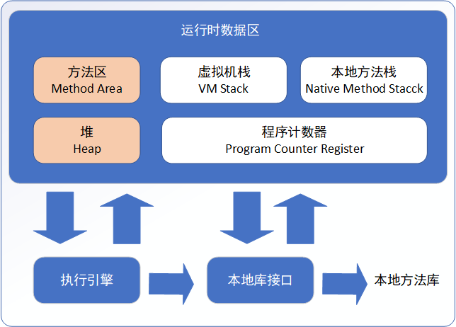

## 二、JVM内存模型之01：概述

#### 1.运行时数据区域

Java虚拟机在执行Java程序的过程中会把它所管理的内存划分为若干个不同的数据区域。这些区域各有各自的用途，以及创建和销毁的时间，有的区域随着虚拟机进程的启动而存在，有些区域则依赖用户线程的启动和结束而建立和销毁。

JDK1.7中，虚拟机所管理的内存包括以下几个运行时数据区域，如图：

图中，白色区域为：线程隔离的数据区；红色区域为：由所有线程共享的数据区。

上图展示的是“JAVA SE7”的JVM虚拟机规范。注意，虚拟机规范并不是一成不变的，Oracle在发布新的JAVA版本时，可能会对JVM做一定的优化和改进，例如在JDK8的版本中，方法区被移除，取而代之的是metaspace（元数据空间）。